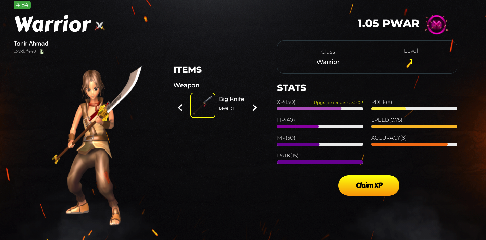

# PolkaWar - NFT MarketPlace & Battle Gaming Platform

With PolkaWar, Experience a new era of blockchain based gaming platform build on Binance Smart Chain and Unity.

PolkaWar is a blockchain based NFT gaming platform and marketplace. Inspired by the recent crypto NFT and gaming narratives, PolkaWar will combine and synergize them both to build an attractive platform.

HomePage View for top characters:

Character Profile View:

Mystery Box Bidding Page View:

Following features are developed:

1. Metamask and Trust Wallet Connection.
2. Airdrop claiming using Interactive Spinning.
3. Profile section.
4. NFT Items and their details.
5. Buy and Sell Feature for NFTs.

## Available Scripts

In the project directory, you can run:

### `yarn start`

Runs the app in the development mode.\
Open [http://localhost:3000](http://localhost:3000) to view it in the browser.

The page will reload if you make edits.\
You will also see any lint errors in the console.

### `yarn build`

Builds the app for production to the `build` folder.\
It correctly bundles React in production mode and optimizes the build for the best performance.

The build is minified and the filenames include the hashes.\
Your app is ready to be deployed!

See the section about [deployment](https://facebook.github.io/create-react-app/docs/deployment) for more information.
